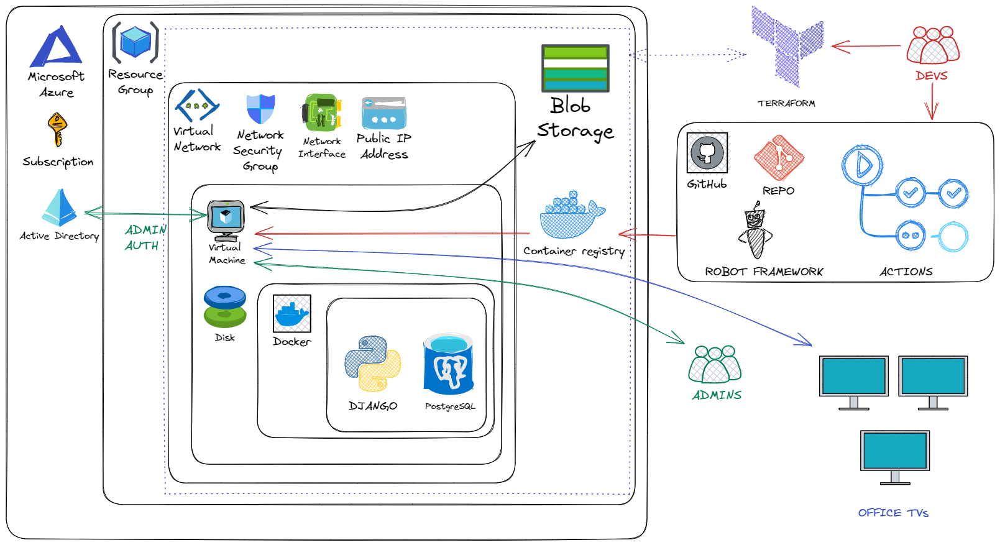

This Infoscreen is developed (Django, Terraform, Actions) by Anssi Yli-Leppälä ([@radianssi](https://github.com/radianssi)) and test automation solution is done by Tea Huovinen ([@teahuovinen](https://github.com/teahuovinen)). Tea also contributed creating Python code for fetching weather data from the OpenWeather API and helping designing layouts and features.

# Infoscreen project
Scope of this project is to create solution for displaying information on a digital screen or monitor also known as digital signage or infoscreen. Screens would be in different offices for example in Helsinki, Kuopio, Oulu and Tampere. Each screen will have it's own content and it is updated in Django based web site running in Azure. With the use of HTML, CSS, and JavaScript, dynamic content, including text and images, will be running on the screens.

Infoscreen isn't finalized and production ready. It is mostly minimum viable product to be developed further. This project also had working CICD pipeline in GitHub Actions. [Atlantis](https://www.runatlantis.io/) for running commands in GitHub PR was tested at PoC level. Commit history isn't available because it was private project before this.


## Features
- Admin page (Django native, some modificatons) where you can control users and content
- Choose in which offices to display content (text and images)
- Choose timeframe when content is displayed
- Option to use Azure AD login for easier authentication using [AngellusMortis/django_microsoft_auth](https://github.com/AngellusMortis/django_microsoft_auth)

## TO-DO
- Modify production infrastructure: run Infoscreen in Azure managed services rather than in VM
- Example screenshots to README

## Architecture


## Prerequisites
The things you need before running Infoscreen. These accounts / APIs are needed:
- Azure account & subscription (owner privileges or at least contributor + role assigment privileges)
- [Open Weather API key](https://openweathermap.org/api) (free)
- [YLE API key](https://developer.yle.fi/en/index.html) (free)

### Locally
- Docker
- Git

### Deploy on the cloud (Azure)
- Azure CLI
- Docker
- Git
- Terraform

### Running Robot Framework tests
- Drivers         (tests/drivers)
- Python 3.XX     (tested with Python 3.11)
- Robot Framework (robot-requiremens.txt)


## Running
Clone the repo.
```
git clone https://github.com/radianssi/django-infoscreen.git
```

Django web app is using Azure Blob Storage to store images that are used in Infoscreen content. Even running locally you have to create at least Azure Blob Storage. Other way is to simulate Blob Storage locally. From Blob Storage you need to store a few values for later use (for .env file):
```
AZURE_STORAGE_ACCOUNT_URL = https://<your-storage-account-here>.blob.core.windows.net/
AZURE_BLOB_CREDENTIAL = <access-key>
```

As statet in prerequisites, you also need to have keys for [Open Weather API](https://openweathermap.org/api) and [YLE API](https://developer.yle.fi/en/index.html). 


### Locally - Creating .env files
To test locally you need at least two .env files for configuration. One for database (PostreSQL) and one for Django web app. Database is fairly simple, create file named ".env.dev.local.db", insert two values and save the file to the root of this repo:
```
POSTGRES_USER=<mydbusername>
POSTGRES_PASSWORD=<mydbpassword>
```

For Django create file called ".env.dev.local". Save the file to the root of this repo. You need a little more values in there so here is the list:
```
DB_HOST=db
DB_ADMIN_USER=<mydbusername>      # same as db .env file
DB_ADMIN_PASSWORD=<mydbpassword>  # same as db .env file
DJANGO_SUPERUSER_PASSWORD=<yourpasswordfordjango>

YLE_API_KEY=app_id=<id-here>&app_key=<key-here>
OPENWEATHER_API_KEY=<yourapikey>
AZURE_STORAGE_ACCOUNT_URL=https://<your-storage-account-here>.blob.core.windows.net/ 
AZURE_BLOB_CREDENTIAL=<youraccesskeyfromazurestorage>

DEBUG=True
DJANGO_SECRET_KEY=<justsomerandomstringhere>
DJANGO_ALLOWED_HOSTS="localhost,example.com"
DJANGO_CSRF_TRUSTED_ORIGINS='http://localhost'

# If you want to try login with Azure AD you need to fill these also
INFOSCREEN_APP_DJANGO_CLIENT_SECRET=<yourappclientsecret>
INFOSCREEN_APP_CLIENT_ID=<yourappclientid>
INFOSCREEN_APP_TENANT_ID=<yourapptenantid>
```

If you want to use Azure AD to create account in Django web app and use it as admin, you need to register app in [Azure AD](https://portal.azure.com/#view/Microsoft_AAD_IAM/ActiveDirectoryMenuBlade/~/RegisteredApps). Then create client secret and copy "Value". Fulfill these as above stated:
```
INFOSCREEN_APP_DJANGO_CLIENT_SECRET = "Value" from created client secret
INFOSCREEN_APP_CLIENT_ID = Application (client) ID
INFOSCREEN_APP_TENANT_ID = Directory (tenant) ID
```

For testing purpose running locally you need to create "Redirect URI" for your app in Azure AD. Go to "Authtentication" and "Add a platform", choose Web and use value http://localhost/microsoft/auth-callback/.


### Locally - Running the web app & database
After setting up everything previously, you can fire up Infoscreen web app from root folder. Docker compose up command will build the web app and create also PostreSQL database.
```
docker compose up -d --build
```

After this you should be able to login from [localhost/admin/](http://localhost/admin/). Use password and try to login with username "Supertest" and password is what you set earlier (DJANGO_SUPERUSER_PASSWORD). This account has all the power.

Now you can try to add Releases and see if you can see it for example in Helsinki site [localhost/infoscreen/Helsinki/](http://localhost/infoscreen/Helsinki/).

For Azure AD authentication try to log in with "Microsoft". Popup window doesn't close automatically usually. Just close it. First time it will not let you in. It creates connection without permissions. After initial log in attempt, log in using password with superuser or other admin account. In the "Users" section you can grant admin privileges for this new Microsoft/Azure AD linked account. After that log in again with "Microsoft" option. Popup window doesn't close automatically usually. Just close it and refresh login page and you should be in.


### Locally - Running Robot Framework tests
To run test, you need to install Robot Framework modules and add web drivers to PATH in OS. Web drivers are in tests/drivers folder. To run all of the Robot Framework tests, best option is to create virtual environment for Python, install depencies and run: 
```
py -m venv .venv-robo
.\.venv-robo\Scripts\activate
pip install -r .\robot-requirements.txt
cd tests
robot .
```
Command `robot .` will run all of the Robot Framework tests in test directories. File run.sh includes three different sets of tests and can be configured to run all of the tests in parallel with Pabot, to run all the tests except for performance tests or to run performance tests only. To run one of these sets, comment others out in the file and execute `run.sh` in command lines above in stead of `robot .`. In all of these cases tests are run in both Chrome headless and Firefox headless.


### Deploying to the cloud (Azure) - Creating infrastructure
Before we can deploy Infoscreen to Azure, we have to create resources and infrastructure in Azure. The easiest way is to use Terraform. If you are familiar with Terraform, you can setup Azure backend and create a Blob Storage for Terraform statefile. 

First create common resources with Terraform. This will create Azure Container Registry. Create "terraform.tfvars" file in the terraform\environments\common\ folder and fill and save these values:
```
project_name                         = "infoscreen"
environment                          = "common"
location                             = "<yourpreferredazurelocation>"
```

For testing purpose \terraform\environments\common\main.tf lines 2 and 3 can be commented out and Terraform statefile will be created and stored locally.From the root of repo follow these steps:
```
az login
cd .\terraform\environments\common\
terraform init
terraform plan
terraform apply -auto-approve
```

After this, go to \terraform\environments\dev\ folder and create "terraform.tfvars" file and insert and save values:
```
project_name                         = "infoscreen"
environment                          = "dev"
location                             = "<yourpreferredazurelocation>"
lvm_custom_data_path_to_file         = "../../scripts/web app-django.sh"
lvm_size                             = "Standard_B1s"
nsg_ssh_security_rule_source_address = ["<your-own-ip-address>"]
nsg_80_security_rule_source_address  = ["<your-own-ip-address>"]
```

Now we can create the infrastructure. For testing purpose \terraform\environments\dev\main.tf lines 2 and 3 can be commented out and Terraform statefile will be created and stored locally. From the root of repo follow these steps:
```
cd .\terraform\environments\dev\
terraform init
terraform plan
terraform apply -auto-approve
```

Now you should have required infrastructure in Azure! Check the outputs and collect them for later use. While we are at it, also take a couple of sensitive values for running the web app:
```
terraform output blob_storage_credential
terraform output app_id
terraform output app_client_secret
terraform output tenant_id
```


### Deploying to the cloud (Azure) - Push Django web app Docker container to Container Registry
The next step is to push Docker image to the Azure Container Registry. Before building and pushing image, you have to update src\nginx_default.conf file. Update line 9 as "server_name" default value "127.0.0.1" to your Azure VM IP and save the file. After that start Docker and execute these commands in the root of repo:
```
az acr login --name <nameofyourcontainerregistry>
docker build -t <nameofyourcontainerregistry>.azurecr.io/infoscreen:latest .
docker push <nameofyourcontainerregistry>.azurecr.io/infoscreen:latest
```


### Deploying to the cloud (Azure) - Set up VM and start Infoscreen
Now it is time to connect VM in Azure. Locate the SSH Key from your computer which Terraform created earlier (.pem file). It should be stored same place where you ran Terraform command in /dev/. Go to that folder with terminal. Check the IP of your VM from Azure portal and run these commands with filled values:
```
ssh -i .\nameofsshkey.pem adminuser@<vm-ip-here>

sudo echo "<app_client_secret>" | sudo docker login <nameofyourcontainerregistry>.azurecr.io --username <app_id> --password-stdin

sudo docker network create -d bridge dbnetwork

sudo docker run -d \
    --name db \
    --network=dbnetwork \
    -e POSTGRES_PASSWORD=<yourdbpassword> \
    -v pgdata:/var/lib/postgresql/data \
    postgres:15.2

sudo docker run -d \
    -p 80:80 \
    --name webapp \
    --network=dbnetwork \
    -e YLE_API_KEY='<your-YLE-API-key-here>' \
    -e OPENWEATHER_API_KEY=<your-OpenWeather-API-key-here> \
    -e DB_HOST=db \
    -e DB_ADMIN_USER=postgres \
    -e DB_ADMIN_PASSWORD=<yourdbpassword> \
    -e AZURE_STORAGE_ACCOUNT_URL='https://<your-storage-account-here>.blob.core.windows.net/' \
    -e AZURE_BLOB_CREDENTIAL=<youraccesskeyfromazurestorage> \
    -e DEBUG=True \
    -e DJANGO_SECRET_KEY=<somerandomstringhere> \
    -e DJANGO_ALLOWED_HOSTS='<ip-address-of-this-azure-vm>,example.com' \
    -e DJANGO_CSRF_TRUSTED_ORIGINS='http://<ip-address-of-this-azure-vm>/' \
    -e INFOSCREEN_APP_DJANGO_CLIENT_SECRET=<yourappclientsecret> \
    -e INFOSCREEN_APP_CLIENT_ID=<yourappclientid> \
    -e INFOSCREEN_APP_TENANT_ID=<yourapptenantid> \
    <nameofyourcontainerregistry>.azurecr.io/infoscreen:latest

sudo docker exec -it webapp /opt/venv/bin/python manage.py createsuperuser

sudo docker exec -it webapp /opt/venv/bin/python manage.py shell

from django.contrib.sites.models import Site
Site.objects.create(domain='<ip-address-of-this-azure-vm>', name='<ip-address-of-this-azure-vm>')
exit()
```

After this you should have database and Django web app running in containers. You can verify it using command "sudo docker ps".

Now you can try to log in with recently created superuser credentials http://ip-address-of-this-azure-vm/admin/. Try to add release in "Helsinki" and see if it can be seen at http://ip-address-of-this-azure-vm/infoscreen/Helsinki/. All set!
